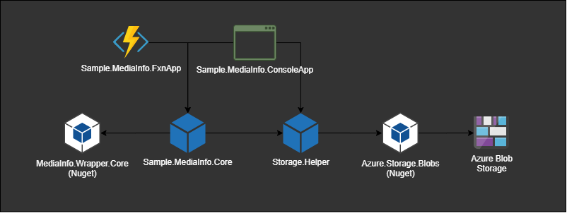
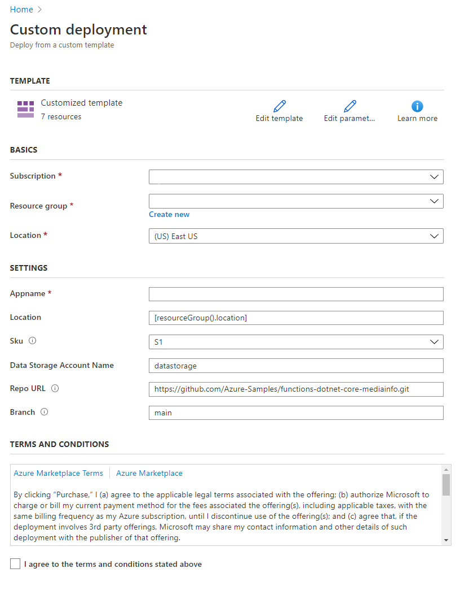

# Reading metadata from videos with MediaInfo library and Azure Functions

It is common in the media space to want to determine the characteristics of a media file.  In a local environment, a commonly used tool is [MediaInfoLib](https://github.com/MediaArea/MediaInfoLib) in the form of the executable program MediaInfo.

> MediaInfo(Lib) is a convenient unified display of the most relevant technical and tag data for video and audio files.

It becomes a bit more difficult to get this metadata from files in cloud storage.  This project provides both an Azure Function and a Console App, both using the cross-platform .NetCore, to retrieve a report on a file stored in Azure Blob Storage.  The console app also demonstrates how to upload a provided test file.

## About the Software Components

The project has two simple libraries, both of which attempt to use [SOLID design principles](https://en.wikipedia.org/wiki/SOLID) and [Clean Architecture](http://cleancoder.com) in general.  For brevity and simplicity, these are not canonical examples of either.

## Storage Interactions

The **Storage.Helper** library provides three services:

1. [Management](./src/Storage.Helper/IAzureStorageManagement.cs): `GetAccountKey`
2. [Operations](./src/Storage.Helper/IAzureStorageOperations.cs): `BlobCopyAsync, BlobUploadAsync, GetSasUrlAsync, ContainerCreateIfNotExistsAsync, BlobExistsAsync, GetBlobContentLengthAsync`
3. [Read Byte-Range Operations](./src/Storage.Helper/IAzureStorageReadByteRangeOperations.cs): `DownloadHttpRangeAsync, GetOrDownloadContentAsync`

It is this latter service which is used in [IMediaInfoReportService](./src/Sample.MediaInfo.Core/IMediaInfoReportService.cs), to only read those bytes required by the MediaInfo library to extract the metadata.

## Authentication and Authorization

The [ServiceCollectionExtensions.cs](./src/Storage.Helper/ServiceCollectionExtensions.cs) in **Storage.Helper** include both Azure Fluent Management and Azure TokenCredential to set up the auth for the project's services.

When deployed to Azure as a Function App, with system assigned managed identity enabled, the web-host will provide the required credentials for both IAzure and TokenCredential objects; which are injected into the service container and used in the implementations.
This managed service principal must have appropriate role based access control to the storage accounts it needs to access via the code sample, and access to the media services resource.

The following are needed to access storage:

- Storage Blob Data Contributor
- Reader and Data Access

Run commands from a shell.azure.com instance, or a bash shell with the Azure CLI tooling, to permit the application.

Follow [this detailed example on how to add these roles](./docs/AddRoles.md).

## Azure Function application settings

On your deployed function app instance, set:

- **AZURE_TENANT_ID**
- **AZURE_SUBSCRIPTION_ID**

Create a local.settings.json file (for Azure Functions) or a appsettings.json file (for the console app) and set the above to test locally.  Template files for the [FunctionApp](./src/Sample.MediaInfo.FxnApp/local.settings.template.json) and [ConsoleApp](./src/Sample.MediaInfo.ConsoleApp/appsettings.template.json) have been provided.  These settings will allow the local user to log in interactively and use their identity for Azure operations, ensure they have sufficient privilege (same as the managed identity).

## Quick Deployment

To quickly deploy the Sample.MediaInfo.FxnApp to Azure, hit the button below:

You will be presented with a screen similar to the image below:

Do the following:

1. Create or Select a Resource Group
1. Enter a Site Name
1. Enter a Hosting Plan Name
1. Hit the *Review + Create* button to validate & deploy the application.

## Testing

### FunctionApp

You can use the simple CURL scripts provided at the end of [MediaInfoFunction.cs](./src/Sample.MediaInfo.FxnApp/Functions/MediaInfoFunction.cs) to test the local (or remote) function app.

### ConsoleApp

Once the appsettings.json is created, simply run the console app to test it.  
As a fall-back if [UploadAndAnalyze.cs](./src/Sample.MediaInfo.ConsoleApp/UploadAndAnalyze.cs) does not find a local file, it will attempt to analyze an existing file in Azure Storage.
